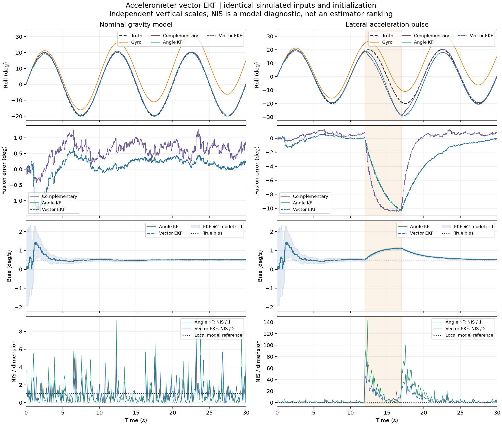

# Meridian

Meridian is an experimental state-estimation and sensor-fusion project. Its first
study targets roll angle and residual gyroscope bias using gyroscope and
accelerometer measurements, with reproducible simulation and offline replay of
real drone bench data.

**Implemented:** Python gyro integration, accelerometer tilt, a complementary
filter, an angle/bias Kalman reference, and an accelerometer-vector EKF, with
controlled simulation, reproducible exports, and numerical tests. On the selected
nominal simulation, angle RMSE is 8.854° for gyro integration, 0.660° for the
complementary filter, 0.354° for the angle KF, and 0.353° for the vector EKF.
A paired translation disturbance exposes failure of the gravity-based observation
model in both Kalman filters. A DataFlash IMU audit checks real-log units,
timing, gaps and health metadata. Offline replay compares gyro, complementary,
angle KF and vector EKF estimates on an explicitly selected log segment with declared
sampling and tuning assumptions. The [historical replay](results/imu-replay/README.md)
has no independent angle reference. A C++17 port of the vector EKF provides a separate numerical core and
event replay executable, checked against Python after every operation.
A static web explorer replays the nominal and translation runs, plus wrong
initialization at two confidence levels, accelerometer loss, changing gyro bias
and underestimated noise, irregular timing and unmodeled delay from the controlled suite. A new documented bench
acquisition remains planned.



The vector EKF comparison combines 100 Hz gyro intervals with 10 Hz accelerometer
components. The EKF corrects directly from the y/z force vector; the earlier
filters use derived tilt. All methods share measurements and a known initial
angle. The [EKF comparison report](results/ekf-comparison/README.md) includes
20 additional paired noise seeds, innovation diagnostics, and local convergence
limits. Near the correct angle, the two Kalman formulations behave similarly;
the nonlinear observation does not remove translation ambiguity.
The noise and timing models are controlled assumptions, not identified sensor characteristics.

The [controlled scenario suite](results/controlled-scenarios/README.md) extends
this comparison to wrong initialization, changing bias, unavailable observations,
irregular intervals, underestimated noise, and unmodeled delay. Estimator tuning
stays fixed. It reports transient and final-window errors; only the nominal case
receives accuracy pass/fail criteria.

The [C++ agreement report](results/cpp-parity/README.md) compares states,
covariances, and innovations on those eight cases plus the translation pulse.
Agreement includes unfavorable cases; it establishes implementation agreement
within numerical tolerances, not improved physical accuracy.

The earlier [gyro-drift baseline](results/gyro-drift/README.md) isolates integration
error from bias and noise, and the [linear reference](results/linear-kalman/README.md)
uses direct synthetic angle observations. All experiments use **mean rates over simulation
intervals**, so the ideal case reconstructs the trajectory up to roundoff by
construction. This is not an established sample convention for real logs.

## Run the experiment

To explore the included results in a browser, install Node.js 22.12+ and run:

```sh
npm --prefix web ci
npm --prefix web run dev
```

Open the local URL printed by the server. The [explorer guide](docs/web-explorer.md)
describes playback, data provenance, reproducible export, tests and static builds.
Viewing the bundled simulations requires no Python environment or drone connection.

The pinned environment was verified with **Python 3.12 on Linux**. From the
repository root:

```sh
python3.12 -m venv .venv
source .venv/bin/activate
python -m pip install -r requirements.lock -e .
python -m meridian.gyro_drift --output outputs/gyro-drift
python -m meridian.kalman_experiment --output outputs/linear-kalman
python -m meridian.accel_experiment --output outputs/accelerometer-fusion
python -m meridian.ekf_experiment --output outputs/ekf-comparison
python -m meridian.stress_experiment --output outputs/controlled-scenarios
python -m pytest -q
```

On Windows with Python 3.12 installed, create the environment with
`py -3.12 -m venv .venv` and run the remaining `python -m ...` commands using
`.venv\Scripts\python.exe` in place of `python`.

Each experiment exports separate measurements, truth, and estimates, plus a JSON
summary and PNG plot. Fusion experiments also export covariance and innovation
diagnostics and evaluate seeds 0–19. Use a **new output directory** for each run;
existing directories are refused. Generated runs under `outputs/` are ignored by
Git. Selected figures and summaries under `results/` document the default runs.

For the C++ EKF, install CMake 3.20+, a C++17 compiler and Eigen 3.4+, then:

```sh
cmake -S . -B build/cpp -DCMAKE_BUILD_TYPE=Release -DMERIDIAN_TEST_PYTHON="$PWD/.venv/bin/python"
cmake --build build/cpp --parallel 2
ctest --test-dir build/cpp --output-on-failure
python -m meridian.cpp_parity --binary build/cpp/meridian_ekf_replay --output outputs/cpp-parity
```

These commands were verified on Linux. The [C++ guide](docs/cpp-ekf.md) describes
dependencies, other build configurations, the event protocol, and comparison
tolerances. The default Python-only test run skips C++ integration tests unless
`MERIDIAN_CPP_BINARY` is set; the configured CTest job supplies the built executable.

For a stationary scenario or a different noise realization:

```sh
python -m meridian.gyro_drift --amplitude-deg 0 --output outputs/stationary
python -m meridian.gyro_drift --seed 7 --output outputs/seed-7
python -m meridian.kalman_experiment --help
python -m meridian.accel_experiment --help
python -m meridian.ekf_experiment --help
python -m meridian.stress_experiment --help
```

For existing DataFlash recordings, install the optional decoder and generate a
local measurement audit:

```sh
python -m pip install -r requirements-dataflash.lock -e '.[dataflash]'
python -m meridian.dataflash_audit /path/to/recording.bin --output outputs/dataflash-audit
```

The [DataFlash audit guide](docs/dataflash-audit.md) describes the input contract,
exports and timing checks. After inspecting its segment IDs, use the
[offline replay](docs/imu-replay.md) to compare estimators on a chosen segment:

```sh
python -m meridian.imu_replay /path/to/recording.bin --instance 0 --segment 0 --output outputs/imu-replay
```

Choose IDs from the audit; the example assumes instance 0, segment 0 exists.
Replay retains source provenance and uses a previous-snapshot gyro hold. Agreement
with accelerometer tilt is a diagnostic, not accuracy against independent truth.
Historical recordings do not establish current acquisition conditions.

## Design and next steps

| Location | Responsibility |
| --- | --- |
| `src/meridian/simulation.py` | Roll truth and gyro, angle, and specific-force measurements. |
| `src/meridian/integration.py` | Gyro integration from interval rates and timestamps. |
| `src/meridian/kalman.py` | Linear angle/bias prediction and correction; no file or plotting dependencies. |
| `src/meridian/ekf.py` | Roll/bias EKF with a nonlinear gravity-vector observation and analytical Jacobian. |
| `cpp/include/meridian/`, `cpp/src/` | Independent C++17/Eigen vector EKF core and public API. |
| `cpp/apps/ekf_replay.cpp` | Explicit prediction/update event replay with strict CSV input. |
| `cpp/tests/` | Native numerical and failure-handling checks, active in Release builds. |
| `src/meridian/cpp_parity.py` | Full-precision input serialization and comparison after every C++/Python operation. |
| `src/meridian/tilt.py` | Tilt extraction, angular wrapping, and complementary roll estimation. |
| `src/meridian/gyro_drift.py` | Experiment configuration, evaluation, plots, and exports. |
| `src/meridian/kalman_experiment.py` | Shared-data comparison, sparse angle observations, and repeated trials. |
| `src/meridian/accel_experiment.py` | Nominal/disturbed comparisons using shared simulated IMU data. |
| `src/meridian/ekf_experiment.py` | Vector EKF comparison on the same inputs, with vector innovations and repeated trials. |
| `src/meridian/stress_scenarios.py` | Fixed controlled scenarios, paired sensor noise, and separate timing/bias truth. |
| `src/meridian/stress_evaluation.py` | Shared-input evaluation of unchanged filters using actual intervals and availability. |
| `src/meridian/stress_experiment.py` | Repeated scenario evaluation, exports, numerical checks, and comparison figures. |
| `src/meridian/dataflash.py` | Optional DataFlash reader with recorded-unit checks and selected metadata. |
| `src/meridian/dataflash_audit.py` | Per-instance timing, measurement inspection and local exports. |
| `src/meridian/replay.py` | Causal roll/bias replay of contiguous snapshots, independent of file formats. |
| `src/meridian/imu_replay.py` | Explicit DataFlash segment selection, replay diagnostics and exports. |
| `src/meridian/web_export.py` | Checked display export from existing paired simulation records. |
| `src/meridian/web_scenarios.py` | Combine the paired runs with selected controlled cases, preserving corrections and provenance. |
| `src/meridian/web_diagnostics.py` | Check endpoint covariance and pre-correction innovations, then export diagnostic states and NIS. |
| `web/` | Static JavaScript/D3 explorer, selected display data, and presentation tests. |
| `tests/` | Numerical contracts, analytical drift, reproducibility, and export checks. |
| `results/` | Selected results and reproduction reports. |

The web explorer reads nine existing simulation runs, with synchronized roll/bias
plots, a roll indicator, and inspection of initial confidence, observation
loss/recovery, bias changes, noise mismatch and sensor timing. It distinguishes
acquisition from arrival time and offers sample-count or elapsed-time RMSE weighting.
Its Diagnostics view plots signed roll/bias errors with model uncertainty and
discrete scalar/vector innovations or NIS. Model uncertainty is not an accuracy guarantee.
Select a diagnostic time window to inspect startup or later behavior with local
plot scales; RMSE and mean NIS remain full-run statistics.
In Trajectories, estimated biases remain held between recorded
corrections; true bias is interpolated along its continuous ramp. Its JavaScript/Vite/D3
presentation works independently of the numerical core. Interactive retuning and
real-log browser replay are not implemented. A new documented bench acquisition
and evaluation of known static poses and slow manual roll remain required.

The [linear Kalman model](docs/linear-kalman.md), [accelerometer fusion model](docs/accelerometer-fusion.md),
and [vector EKF model](docs/vector-ekf.md), with the [controlled evaluation contract](docs/controlled-scenarios.md)
and [C++ agreement contract](docs/cpp-ekf.md),
specify timing, noise, initialization, and limitations.
The [design and validation approach](docs/design.md) defines the broader models,
assumptions, software boundaries, and remaining decisions. Real bench acquisition
and replay are part of completing the study: the drone remains disarmed, with
propellers removed, and Meridian stays outside the flight-control loop. No
embedded, real-time, or flight validation is claimed. Additional estimation tasks
and integrations are possible future directions.
