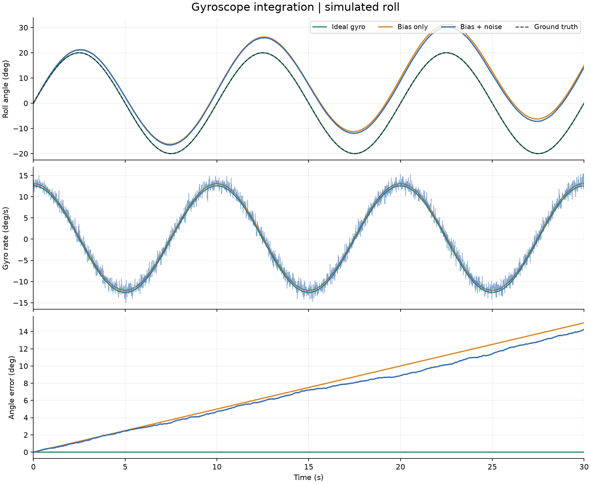

# Meridian

Meridian is an experimental state-estimation and sensor-fusion project. Its first
study targets roll angle and residual gyroscope bias using gyroscope and
accelerometer measurements, with reproducible simulation and offline replay of
real drone bench data.

**Implemented:** a Python gyroscope integration baseline, a controlled roll
simulation, reproducible CSV/JSON exports, plots, and numerical tests. A constant
gyro bias of 0.5°/s produces 15° of angle error after 30 seconds in the default
experiment. Kalman filtering, accelerometer fusion, C++, bench replay, and the web
interface remain planned.



The experiment compares an ideal gyro, constant bias, and bias with noise on the
same motion. Rates are **means over each simulation interval** and the initial
angle is known: ideal reconstruction is exact by construction, up to floating-point
roundoff. This isolates sensor drift from quadrature and initialization errors.
See the [experiment report](results/gyro-drift/README.md) for parameters, measured
results, and limitations.

## Run the experiment

The pinned environment was verified with **Python 3.12 on Linux**. From the
repository root:

```sh
python3.12 -m venv .venv
source .venv/bin/activate
python -m pip install -r requirements.lock -e .
python -m meridian.gyro_drift --output outputs/gyro-drift
python -m pytest -q
```

On Windows with Python 3.12 installed, create the environment with
`py -3.12 -m venv .venv` and run the remaining `python -m ...` commands using
`.venv\Scripts\python.exe` in place of `python`.

Each run writes `measurements.csv`, `truth.csv`, `estimates.csv`, `summary.json`,
and `overview.png`. Use a **new output directory** for each run; existing directories
are refused. Generated runs under `outputs/` are ignored by Git. The selected
figure and summary under `results/` document the default run.

For a stationary scenario or a different noise realization:

```sh
python -m meridian.gyro_drift --amplitude-deg 0 --output outputs/stationary
python -m meridian.gyro_drift --seed 7 --output outputs/seed-7
python -m meridian.gyro_drift --help
```

## Design and next steps

| Location | Responsibility |
| --- | --- |
| `src/meridian/simulation.py` | Roll truth and idealized gyro measurement generation. |
| `src/meridian/integration.py` | Gyro integration from interval rates and timestamps. |
| `src/meridian/gyro_drift.py` | Experiment configuration, evaluation, plots, and exports. |
| `tests/` | Numerical contracts, analytical drift, reproducibility, and export checks. |
| `results/gyro-drift/` | Selected result and its reproduction report. |

Next comes a linear Kalman reference for angle and bias, followed by accelerometer
fusion, a complementary baseline, and a C++ EKF with a justified nonlinear
measurement model. A lightweight web interface will expose comparison plots and
time-based replay after the first filter comparisons exist. Its technology stack
is undecided; the numerical core works independently of the presentation layer.

The [design and validation approach](docs/design.md) defines the models,
assumptions, software boundaries, and remaining decisions. Real bench acquisition
and replay are part of completing the study: the drone remains disarmed, with
propellers removed, and Meridian stays outside the flight-control loop. No
embedded, real-time, or flight validation is claimed. Additional estimation tasks
and integrations are possible future directions.
