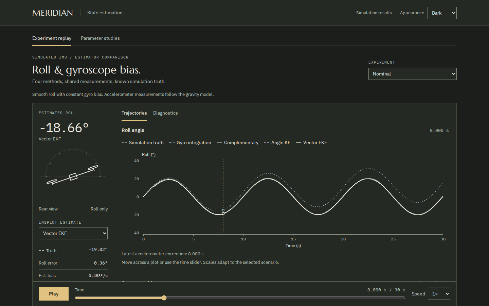

# Meridian

**Work in progress. V1 isn't ready yet.**

Meridian is my state estimation and sensor fusion project. I'm starting with a
drone's roll angle, meaning how far it tilts to either side, using gyroscope and
accelerometer measurements.

A small error in the gyroscope adds up over time. The accelerometer can help
correct it, but movement can also make that correction wrong. I'm comparing
filters in simulation and on recorded sensor data to see where each one works
and where it fails.



*The current explorer, showing a saved simulation. The dotted gyro curve drifts
away from the reference as errors accumulate. [Screenshot details](docs/media/README.md).*

[Try the explorer](#try-the-explorer) · [Results](#experiments-and-results) ·
[Technical setup](#technical-setup) · [Design notes](docs/design.md)

## What exists so far

- Python experiments comparing gyro integration, a complementary filter and
  Kalman filters on the same measurements, including cases where they fail.
- A browser interface to replay the saved simulations, inspect errors and
  compare repeated trials and filter settings.
- A C++17 implementation of the extended Kalman filter (EKF), checked against
  Python after each prediction and correction.
- Tools to inspect recorded drone sensor data and replay a selected log segment
  through the filters offline.

The first study is still incomplete. A new bench recording with known angles
is needed to check the estimates against a physical reference. The historical
recording used so far has no independent angle reference, so it cannot tell us
the filters' real accuracy.

This is currently a single-axis study. Meridian has not been validated onboard,
in real time or in flight. The planned bench work keeps the drone disarmed, with
propellers removed and the estimator outside the flight-control loop.

## Try the explorer

The prototype includes saved results you can explore locally. You need
**Node.js 22.12+** and npm; no Python setup or drone connection is needed.

```sh
git clone https://github.com/victormonnot/meridian.git
cd meridian
npm --prefix web ci
npm --prefix web run dev
```

Open the local URL printed in the terminal. Start with **Nominal**, then choose
**Translation disturbance** to see what happens when acceleration is mistaken
for tilt. Use the time slider to compare an estimate with the simulated reference.

**Diagnostics** shows errors and filter uncertainty. **Repeated trials** compares
runs with different sensor noise. **Parameter studies** shows how saved runs
change with different filter settings.

The browser reads recorded results. It doesn't run or retune the filters, and
real-log playback isn't available in the interface yet.
See the [explorer guide](docs/web-explorer.md) for the views, controls and build commands.

## Experiments and results

Each report explains the inputs, assumptions, results and how to reproduce them.
The simulations include known motion for comparison; the historical log does not.

| Study | What it looks at |
| --- | --- |
| [Gyro drift](results/gyro-drift/README.md) | How noise and sensor bias accumulate into angle error. |
| [Linear Kalman filter](results/linear-kalman/README.md) | An initial reference using synthetic angle measurements. |
| [Accelerometer fusion](results/accelerometer-fusion/README.md) | Combining gyro and accelerometer data, with and without a translation disturbance. |
| [Vector EKF](results/ekf-comparison/README.md) | Comparing the nonlinear filter with the earlier methods on shared inputs. |
| [Controlled scenarios](results/controlled-scenarios/README.md) | Wrong initial angle, missing measurements, changing bias, noise and timing problems. |
| [Filter settings](results/r-sensitivity/README.md) and [changing bias](results/bias-random-walk/README.md) | Separate studies of measurement uncertainty and the bias model, with exploration and final evaluation runs. |
| [Python/C++ agreement](results/cpp-parity/README.md) | Checking both implementations after every operation, including in failure cases. |
| [Recorded IMU replay](results/imu-replay/README.md) and [C++ comparison](results/imu-cpp-parity/README.md) | Offline replay of a historical drone log, without an independent angle reference. |

Good results in a simulation don't establish accuracy on hardware. Likewise,
Python/C++ agreement checks the port, not the physical model. The raw historical
log is not included in this repository; its report contains aggregate results.

## Technical setup

The numerical core uses Python/NumPy and C++17/Eigen. The explorer uses
JavaScript, Vite and D3, separately from the estimation code.

### Python experiments

The pinned environment was verified with **Python 3.12 on Linux**. From the
repository root:

```sh
python3.12 -m venv .venv
source .venv/bin/activate
python -m pip install -r requirements.lock -e .
python -m meridian.ekf_experiment --output outputs/ekf-comparison
python -m pytest -q
```

Use a **new output directory** for each experiment; existing directories are
refused. Generated runs under `outputs/` are ignored by Git. They include
measurements, simulation truth, estimates, a JSON summary and plots.
The reports above contain the commands for each study.

On Windows with Python 3.12 installed, create the environment with
`py -3.12 -m venv .venv` and replace `python` in the remaining commands with
`.venv\Scripts\python.exe`. Windows is not part of the tested platform matrix.

### C++, recorded data and checks

- [C++ guide](docs/cpp-ekf.md): dependencies, build, native tests and comparison
  with Python. Requires CMake 3.20+, a C++17 compiler and Eigen 3.4+.
- [DataFlash audit](docs/dataflash-audit.md) and [offline replay](docs/imu-replay.md):
  optional decoder setup, timing inspection and explicit log-segment selection.
- [CI guide](docs/ci.md): full Python/C++ checks, synthetic DataFlash fixtures,
  web tests and production build. The Python-only command above skips C++
  integration tests unless `MERIDIAN_CPP_BINARY` points to the built executable.
- [Design and validation](docs/design.md): models, assumptions, software boundaries
  and remaining work.

The [GitHub Actions history](https://github.com/victormonnot/meridian/actions)
shows hosted checks. Browser interaction and physical validation are separate
from those automated jobs.
