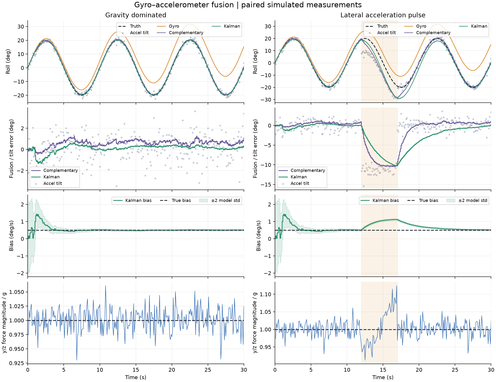

# Gyro–accelerometer fusion and a translation disturbance

This paired experiment compares gyro integration, raw accelerometer tilt, a
complementary filter, and the angle/bias Kalman reference. Both scenarios use
identical gyro and accelerometer noise. Only the prescribed translational
acceleration changes.



The left column is gravity dominated. The right adds body-y acceleration of
+2 m/s² from 12 s inclusive to 17 s exclusive (shaded). Rows show angles,
fusion/tilt errors, Kalman bias, and the y/z specific-force magnitude divided by g.
Vertical scales are independently fitted to each panel. Gyro drift appears in
the first row; the second isolates fusion and raw-tilt errors.

## Model and reproduction

The [model specification](../../docs/accelerometer-fusion.md) defines the FRD frame,
specific force, tilt signs, approximate angle variance, complementary time constant,
wrapped innovations, and evaluation criteria selected before running the experiment.

| Setting | Value |
| --- | --- |
| Roll truth | ±20° sinusoid, 0.1 Hz, 30 s |
| Gyro | 100 Hz interval means; +0.5°/s constant bias; noise std 1°/s per sample |
| Accelerometer | y/z endpoint observations at 10 Hz; independent per-axis noise std 0.2 m/s² |
| Gravity | 9.80665 m/s² |
| Kalman angle noise | Fixed nominal std sigma_a/g = 1.168509°; first-order approximation |
| Complementary time constant | 1 s |
| Initialization | Known angle 0° for all estimates; Kalman bias 0°/s with std 1°/s |
| Displayed / repeat seeds | 42 / 0–19; each seed produces a matched scenario pair |
| Environment | Python 3.12.3, NumPy 2.5.3, Matplotlib 3.11.2, Linux |

Install the pinned environment using the [repository README](../../README.md), then
run from the root with a new output directory:

```sh
python -m meridian.accel_experiment --output outputs/accelerometer-fusion
python -m pytest -q
```

The CLI exports both displayed scenarios and metrics for 20 additional pairs.
It exits with status 1 if a nominal default-configuration criterion fails, while
preserving outputs for inspection. Custom noise or time-constant settings do not
inherit the default accuracy criteria. Changing requested seeds applies the
default thresholds only to those requested nominal trials.

## Selected seed 42

Angle errors for gyro and filters are unwrapped estimate minus truth; raw tilt
uses principal angle error. No branch crossing occurs in this displayed trajectory.
RMSE over all endpoints includes the known initialization.

| Method | Nominal all-endpoint RMSE (°) | Disturbed all-endpoint RMSE (°) | Nominal RMSE at observation epochs (°) | Disturbed RMSE at observation epochs (°) |
| --- | ---: | ---: | ---: | ---: |
| Gyro integration | 8.853980 | 8.853980 | 8.875583 | 8.875583 |
| Complementary | 0.659617 | 3.877226 | 0.641455 | 3.886710 |
| Kalman | 0.353940 | 3.878906 | 0.347889 | 3.869463 |
| Raw accel tilt | Not defined between observations | Not defined between observations | 1.186237 | 4.717139 |

The Kalman nominal final bias is **0.500937°/s**, against a true +0.5°/s. In the
disturbed run, the bias estimate rises to **1.119752°/s during the pulse**, although
the true bias remains constant. By 30 s it reaches 0.510013°/s. An apparently good
final estimate therefore does not describe the full transient.

| Disturbed angle RMSE window | Complementary (°) | Kalman (°) |
| --- | ---: | ---: |
| Before, t < 12 s | 0.581552 | 0.478756 |
| During, 12 ≤ t < 17 s | 8.956963 | 7.417935 |
| After, t ≥ 17 s | 1.879181 | 3.653398 |

Kalman reduces nominal noise and bias error, but the sustained false tilt also
changes its bias estimate. The complementary filter recovers faster in this
particular post-pulse window. Whole-run errors are nearly equal here; these results
do not establish a universal ranking.

The covariance histories are identical across the paired runs because their
timing, initial P, Q, and R are identical. Covariance does not automatically detect
this observation-model violation. Mean squared normalized innovation rises from
1.021764 nominally to 9.299290 with the pulse; this is an exported diagnostic, not
a formal consistency test or a rejection mechanism.

## Repeated pairs

| Metric, seeds 0–19 | Nominal mean | Nominal worst | Disturbed mean | Disturbed worst |
| --- | ---: | ---: | ---: | ---: |
| Complementary angle RMSE (°) | 0.534813 | 0.638108 | 3.967481 | 4.028260 |
| Kalman angle RMSE (°) | 0.245127 | 0.327128 | 4.038472 | 4.167322 |
| Absolute final Kalman bias error (°/s) | 0.011717 | 0.046627 | 0.015439 | 0.055720 |

Seed 42 and all 20 nominal repeats pass the predeclared per-run limits: Kalman
RMSE < 0.75°, complementary RMSE < 1°, and absolute final bias error < 0.15°/s.
No tuning changed after evaluation. Disturbed scenarios characterize a model
violation and have no nominal accuracy threshold. These are repeats of one fixed
configuration, not a survey of motion, calibration, or real IMU behavior.

Full-precision metrics, before/during/after windows, settings, generator seeds,
and repeat results are in [summary.json](summary.json).

## Outputs and checks

The selected figure and summary are copied unchanged from the executed run. The
module and installed CLI were run independently and produced byte-identical CSV,
JSON, and PNG outputs in the listed environment; cross-platform identity has not
been tested. The
output directory also contains separate `nominal/` and `translation_pulse/`
folders:

| File in each scenario | Contents |
| --- | --- |
| `gyro_measurements.csv` | Interval start/end in s and measured rate in rad/s. |
| `accel_measurements.csv` | Observation time in s and measured y/z specific force in m/s². |
| `derived_tilt.csv` | Observation time, principal tilt in rad, y/z magnitude in m/s². |
| `truth.csv` | Endpoint time, true unwrapped roll in rad, true gyro bias in rad/s. |
| `disturbance_truth.csv` | Observation time and prescribed body-y/z translation in m/s². |
| `estimates.csv` | Endpoint estimates plus Kalman bias and angle/bias covariance entries. |
| `innovations.csv` | Correction time, prior wrapped innovation in rad and predicted variance in rad². |

State/covariance records follow any correction at their endpoint, otherwise the
prediction. Covariance units remain rad², rad²/s and rad²/s². Raw-tilt metrics use
only available observation timestamps; its final error is at the last observation,
which coincides with the final endpoint for the default configuration.

Tests include independently specified poses, known constant-bias complementary
steady state, branch crossings and preserved turn count, scalar Kalman corrections,
sparse observation timing, paired noise, and separated exports. A seeded 50,000-sample
check at two poses compares nominal tilt variance with the first-order formula.
A separate counterexample demonstrates a false tilt with exactly unchanged
gravity magnitude. Existing direct-angle Kalman results remain reproducible.

## Limits and continuation

The disturbance is prescribed translational acceleration resolved in body axes;
no full rigid-body translation trajectory, lever-arm effects, vibration,
temperature, calibration error, filtering delay, or asynchronous acquisition is
simulated. The y/z magnitude equals the full noiseless magnitude only under the
assumed zero x-component; it is not a three-axis norm measurement.

The current filters accept finite nondegenerate tilt observations without adaptive
gating. Near-g magnitude does not prove that an observation represents gravity.
The angular Gaussian noise model and covariance bands are approximate even in the
nominal case and do not account for the pulse.

Next, inspect current bench measurements and their timing, and develop the
nonlinear accelerometer-vector reference within the documented scope. An EKF
alone will not remove the translation ambiguity. Real acquisition and replay
remain required; no embedded, real-time, or flight validation is claimed.
