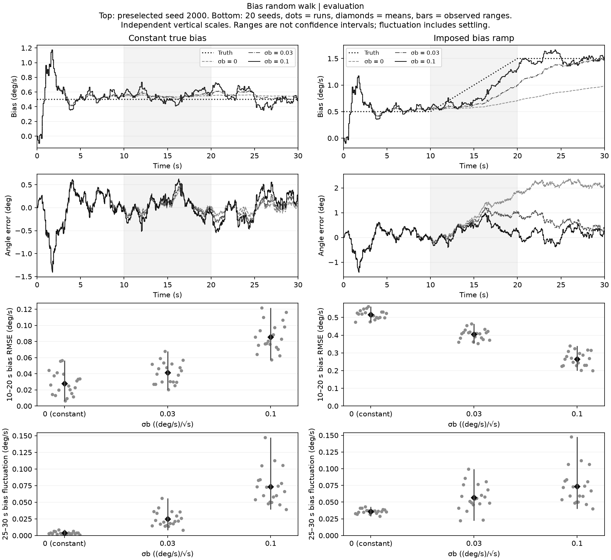

# Bias random walk: tracking and fluctuation

Allowing bias diffusion improves tracking of the imposed bias ramp, while adding
fluctuation when the true bias is constant. On 20 final-evaluation seeds, an
intensity of 0.1 (deg/s)/sqrt(s) lowers the ramp case's mean full-run angle RMSE
from 1.3518° to 0.3385°. In the constant case, mean late bias-error fluctuation
rises from 0.0038 to 0.0734 deg/s. Zero remains the project default.

The [model and protocol](../../docs/bias-random-walk.md) were fixed before these
runs on 2026-09-15. All three intensities, both cases, metrics and windows were
retained after exploration; no setting was selected using evaluation outcomes.
The model adds a continuous bias-diffusion covariance to the existing vector EKF
in Python and C++. It does not predict the ramp slope or identify a physical
sensor noise density.



The top plots use the preselected first evaluation seed, 2000. Lines connect
stored endpoints; they do not establish continuous-time or sub-sample accuracy.
The lower plots retain all 20 seeds: dots are runs, diamonds means and bars
observed min–max ranges, not confidence intervals. Panel scales are independent.
The 10–20 s shading marks the scoring window and the ramp interval in that case.

## Final evaluation: seeds 2000–2019

Intensity means sigma_b in **(deg/s)/sqrt(s)**, converted to SI before construction.
R remains 0.2² I, and initial state, P0 and gyro noise are unchanged. The exact
additional covariance is sigma_b² [[dt³/3, -dt²/2], [-dt²/2, dt]]. Predictions
retain the current mean bias; observations correct it as uncertainty grows.

Each full-run RMSE includes 3,001 endpoints over 30 s. The closed 10–20 s
tracking window contains 1,001 endpoints. Table entries are arithmetic means of
per-run metrics, not a pooled RMSE.

| True bias | Intensity | Full angle RMSE (°) | Full bias RMSE (°/s) | 10–20 s bias RMSE (°/s) | Mean joint NIS |
| --- | --- | --- | --- | --- | --- |
| Constant | 0 | 0.2349 | 0.1198 | 0.0280 | 2.0145 |
| Constant | 0.03 | 0.2541 | 0.1231 | 0.0412 | 2.0083 |
| Constant | 0.1 | 0.2969 | 0.1427 | 0.0857 | 1.9995 |
| Ramp | 0 | 1.3518 | 0.5184 | 0.5165 | 3.3583 |
| Ramp | 0.03 | 0.5853 | 0.3098 | 0.4040 | 2.2334 |
| Ramp | 0.1 | 0.3385 | 0.2117 | 0.2655 | 2.0275 |

The fixed late window is **25 <= t <= 30 s**, including 501 endpoints, without a
filter restart. Bias fluctuation is the population temporal standard deviation
(ddof=0) of bias error around its own late-window mean. It includes possible
residual settling and correlated errors; it is not an identified white-noise level.

| True bias | Intensity | Late angle RMSE (°) | Late bias RMSE (°/s) | Late signed bias error mean (°/s) | Late bias fluctuation mean [min, max] (°/s) |
| --- | --- | --- | --- | --- | --- |
| Constant | 0 | 0.1827 | 0.0180 | -0.0058 | 0.0038 [0.0011, 0.0086] |
| Constant | 0.03 | 0.2322 | 0.0372 | -0.0110 | 0.0250 [0.0080, 0.0562] |
| Constant | 0.1 | 0.2945 | 0.0869 | -0.0116 | 0.0734 [0.0390, 0.1472] |
| Ramp | 0 | 2.1486 | 0.6316 | -0.6305 | 0.0361 [0.0287, 0.0431] |
| Ramp | 0.03 | 0.4921 | 0.1259 | -0.1101 | 0.0570 [0.0225, 0.0993] |
| Ramp | 0.1 | 0.2991 | 0.0859 | -0.0024 | 0.0736 [0.0399, 0.1476] |

## Paired comparisons and exploration

A difference is computed per seed as the setting's metric minus the constant
model's metric on the exact same serialized measurements. Negative RMSE differences mean
smaller observed error. The table uses the bias RMSE over 10–20 s in both cases;
this window is also scored when the bias is constant.

| True bias | Intensity | Final mean paired difference [min, max] (°/s) | Negative / zero / positive | Exploration mean difference (°/s) |
| --- | --- | --- | --- | --- |
| Constant | 0.03 | +0.0133 [-0.0021, +0.0331] | 1 / 0 / 19 | +0.0109 |
| Constant | 0.1 | +0.0577 [+0.0216, +0.1084] | 0 / 0 / 20 | +0.0581 |
| Ramp | 0.03 | -0.1126 [-0.1511, -0.0758] | 20 / 0 / 0 | -0.1062 |
| Ramp | 0.1 | -0.2510 [-0.3241, -0.1845] | 20 / 0 / 0 | -0.2400 |

Both positive intensities improve ramp-window bias RMSE on all 20 final seeds.
The constant case exposes the cost: the mean tracking-window error and late
fluctuation increase. No universal optimum follows from these two cases and
three settings. A deterministic ramp is not sampled from the assumed random-walk
prior, and the nominal case deliberately has no physical diffusion.

Exploration used seeds 0–19; final seeds 2000–2019 were reserved before execution.
The earlier R study consumed 1000–1019. Implementation checks used 42 and 0 only.
The phases share the same motion/noise family; they do not demonstrate performance
on a new motion distribution. Final seeds are now consumed and cannot serve as
an untouched reserve for later tuning. This was a dated local protocol, not an
external registration.

The [exploration JSON](exploration-summary.json), [evaluation JSON](evaluation-summary.json)
and [exploration figure](exploration.png) retain all settings and scores. Each
metric has a mean and observed min–max; each RMSE has paired sign counts. Cases
share force measurements and gyro noise draws, but the ramp changes gyro
measurements after 10 s. Neither cases nor phases are pooled as independent trials.

## Python/C++ agreement and reproduction

For each reported trial, the experiment serializes the inputs once and gives the
same operations to every setting and both implementations. It compares states,
all P entries, prior innovations and all S entries after every operation, using
the [existing tolerances](../../docs/cpp-ekf.md). Scoring selects only one posterior
per physical endpoint, avoiding a second count for prediction before correction.
Finite values, covariance symmetry and eigenvalues are checked on both complete
traces. A comparison or numerical failure aborts the experiment.

Across both phases, **240 paired runs**, **792,240 record pairs** and **5,185,440 finite scalar pairs** pass. The largest fraction of any allowed tolerance is **2.90199e-05** (a value above 1 would fail). Agreement includes unfavorable constant-bias outcomes and is not an additional accuracy claim.


```sh
cmake -S . -B build/cpp -DCMAKE_BUILD_TYPE=Release -DBUILD_TESTING=ON
cmake --build build/cpp --parallel 2
python -m meridian.bias_experiment --binary build/cpp/meridian_ekf_replay --phase exploration --output outputs/bias-exploration
# Inspect exploration while preserving the declared grid and metrics.
python -m meridian.bias_experiment --binary build/cpp/meridian_ekf_replay --phase evaluation --output outputs/bias-evaluation
```

Use new output directories and the pinned Python environment. Each phase exports
22 files: a summary, a figure and ten CSVs per case for the preselected first seed
(0 or 2000). Those CSVs contain separate measurements, truth, serialized events
and all three Python/C++ trace pairs, with round-trip binary64 decimal precision.
Other seeds retain complete metric and agreement summaries; rerunning reconstructs
their input operations and full traces before comparison.

The summaries record the protocol, root/child seeds, event fingerprints, six
Python source hashes, C++ binary fingerprint/build metadata and environment.
Source and binary hashes are captured before calculation and checked afterwards;
a change during a run is refused. The C++ CLI remains protocol 1, with its new
bias option optional and the original seven numeric options still required.
A separately rebuilt pre-extension implementation and the new omitted/explicit-zero
settings produced byte-identical CSVs across 300 deterministic events.

Verified on Linux with Python 3.12.3, NumPy 2.5.3, Matplotlib 3.11.2, GCC 13.3.0,
CMake 3.28.3 and Eigen 3.4.0 in Release. **765 Python tests pass with no skips**,
including 56 new model/experiment tests and native integration. The native
CTest target passes **22,294 checks**. Independent checks cover covariance
integration and interval composition, unchanged defaults, failure atomicity,
truth separation, scoring windows, joint NIS and invalid evidence despite matching
implementations.

Both complete phases were reproduced from a separate public-source snapshot and
a fresh C++ Release build, using the same pinned Python environment. All **44
exports** and the rebuilt replay binary fingerprint are byte-identical. No
personal project files or recorded drone logs were needed. This establishes local
reproduction in that environment, not equivalence across arbitrary toolchains.

No real sensor noise density was identified. R remains fixed, there is no adaptive
gating or deterministic slope state, and the scalar Kalman reference remains
constant-bias. Existing default reports/web data retain zero diffusion. A documented
bench acquisition with an independent reference is still pending; no embedded,
real-time or flight validation is claimed.
