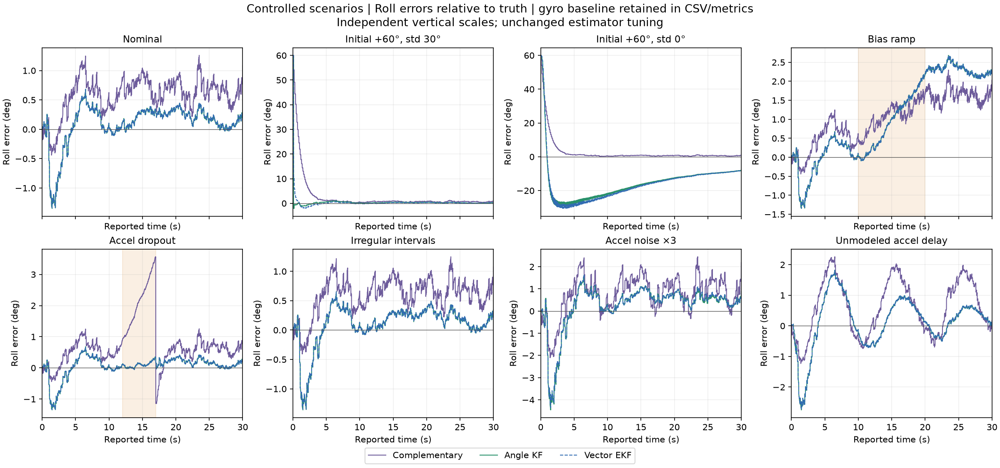
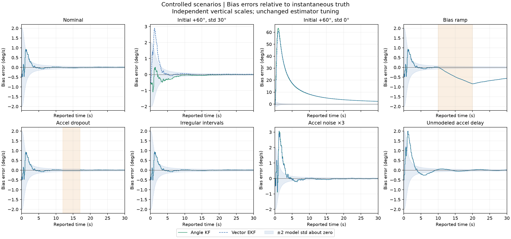

# Controlled initialization, bias, and sensor scenarios

Eight fixed scenarios exercise the existing Python filters with unchanged tuning.
The purpose is to measure consequences of incorrect assumptions and missing data,
with reproducible inputs and explicit limits. The
[evaluation contract](../../docs/controlled-scenarios.md) specifies the scenarios,
noise pairing, metrics, and criteria declared before execution.



The panels use independent vertical scales. The orange spans mark the bias ramp
or missing accelerometer interval. Gyro integration is retained in the tables and
CSV outputs; the figure focuses on the three fusion estimates.

## Reproduce

Use the pinned Python 3.12 environment in the [README](../../README.md):

```sh
python -m meridian.stress_experiment --output outputs/controlled-scenarios
python -m pytest -q
```

The installed command is `meridian-controlled-scenarios`. Select a new output
directory; existing directories are refused. `--seed` chooses the displayed run;
`--validation-seeds` chooses the repeat count starting at seed 0 (default 20).
The scenario definitions and estimator settings remain fixed by this CLI.

This snapshot used Python 3.12.3, NumPy 2.5.3, and Matplotlib 3.11.2 on Linux.
Module and installed-command executions produced **67 byte-identical artifacts**.
The two figures and [summary](summary.json) were copied unchanged from those runs.
The full public suite passed **446 tests**, including 72 added for these scenarios.
No private log is needed to reproduce the tests or this report.

Each execution evaluates **168 trials**: eight cases for displayed seed 42 and
for each seed 0–19. All cases pass the finite-output and covariance numerical
contracts. Both Kalman filters pass the nominal per-run limits, roll RMSE <0.75°
and final absolute bias error <0.15°/s, for every requested nominal trial.
**Stress cases have no accuracy pass/fail label.** Numerical health does not
imply correct physical estimates, as the overconfident case demonstrates.

## Selected results: seed 42

Roll RMSE in degrees over all 3,001 endpoints, including initialization. The last
column uses only endpoints at or after 25 s; it is not a convergence-time estimate.

| Scenario | Gyro | Complementary | Angle KF | Vector EKF | EKF, last 5 s |
| --- | ---: | ---: | ---: | ---: | ---: |
| `nominal` | 8.853980 | 0.659617 | 0.353940 | 0.353101 | 0.125677 |
| `initial_offset` | 67.801188 | 8.147968 | 3.491880 | 3.573630 | 0.107245 |
| `initial_overconfident` | 67.801188 | 8.147968 | 19.441427 | 20.230017 | 9.238518 |
| `bias_ramp` | 14.639079 | 1.208639 | 1.524812 | 1.523883 | 2.222679 |
| `accel_dropout` | 8.853980 | 1.077156 | 0.334587 | 0.334022 | 0.118709 |
| `timing_jitter` | 8.942424 | 0.667763 | 0.355551 | 0.354618 | 0.135767 |
| `accel_noise_mismatch` | 8.853980 | 1.141028 | 1.049504 | 1.039988 | 0.539753 |
| `accel_delay` | 8.853980 | 1.084637 | 0.853802 | 0.855216 | 0.477928 |

The nominal inputs, estimates, covariances, and innovations reproduce the earlier
[EKF comparison](../ekf-comparison/README.md) exactly. Time-weighted RMSE is also
retained in the summary, with its trapezoid approximation documented in the contract.

**Initialization confidence matters.** The two 60° initial-error cases receive
identical measurements. With initial angle std 30°, the EKF's final-five-second
RMSE is 0.107245°. Declaring that same wrong angle exact leaves 9.238518° over
that window. In the latter case the bias estimate is also badly contaminated:
its maximum absolute error is 60.897891°/s and final error is +2.277863°/s, although
the true bias remains +0.5°/s. Early cross-covariance routes the large angle
residual into a bias correction. The favorable uncertain-initialization outcome
is not a global-convergence guarantee; the existing opposite-vector core test
still demonstrates a local EKF failure.

**A constant-bias model lags a changing bias.** With truth ramping from 0.5 to
1.5°/s, the EKF's final bias error is -0.565289°/s and late angle RMSE is 2.222679°.
The complementary filter's late angle RMSE is 1.633998° in this case. No bias
process noise or additional state was introduced to improve this result.

**This dropout occurs after bias has been estimated.** All gyro samples remain
available while 50 accel arrivals from 12 through 16.9 s are omitted. The EKF
maintains low error in this favorable constant-bias interval; its lower total
RMSE than nominal for this realization is not evidence that dropping data helps.
The complementary filter, which has no bias estimate, drifts during the gap and
uses a stronger correction when observations return after 5.1 s.

**Correct time handling is distinct from delay compensation.** Jitter gives gyro
durations from 4.970950 to 14.900578 ms for seed 42. Every prediction uses its
actual duration, and every correction its actual arrival. The separate delay case
instead applies force from 0.1 s earlier without compensation; EKF roll RMSE rises
to 0.855216°. Source times are known to the simulator only. Neither experiment
identifies the timestamp semantics or latency of real IMU recordings.

**Underestimated noise increases error without widening P.** Tripling actual
accel noise while retaining R raises EKF RMSE to 1.039988°. Mean vector NIS rises
from 1.966964 to 17.595715. This diagnoses a model mismatch; it does not estimate
sensor noise automatically or reject any measurement.

## Bias and model uncertainty



Bias errors use the instantaneous endpoint truth, not the gyro interval-average
bias. The shaded band is ±2 model standard deviations **about zero error**.
The two Kalman covariance histories agree within every case; the band is drawn
once from the EKF. It is not calibrated uncertainty or a coverage guarantee.

Nominal, overconfident initialization, bias ramp, noise mismatch, and delay share
P0, Q, R, and update schedules. Their covariance histories therefore agree despite
very different errors. Maximum KF/EKF difference among stored SI covariance
entries across the displayed cases is 1.15e-19. Numerical checks allow 1e-12 for
roundoff and do not validate the correctness of the measurement model.

Vector and scalar innovations have two and one dimensions respectively. Their
raw NIS values cannot be ranked as equivalent accuracy scores. Diagnostics and
all signed final bias errors are retained per run in the JSON.

## Additional seeds 0–19

The displayed seed 42 is excluded from these aggregates. Values are mean / worst
in degrees; worst means the largest error metric among this fixed repeat set.
All four estimators' aggregates and individual runs remain in the JSON.

| Scenario | EKF whole-record RMSE | EKF last-five-second RMSE |
| --- | ---: | ---: |
| `nominal` | 0.244815 / 0.327756 | 0.182179 / 0.327777 |
| `initial_offset` | 3.561339 / 3.612179 | 0.197986 / 0.372594 |
| `initial_overconfident` | 20.311617 / 20.569207 | 9.404070 / 9.638326 |
| `bias_ramp` | 1.348445 / 1.481519 | 2.100772 / 2.431467 |
| `accel_dropout` | 0.282467 / 0.437915 | 0.182701 / 0.336421 |
| `timing_jitter` | 0.246363 / 0.337683 | 0.183222 / 0.360213 |
| `accel_noise_mismatch` | 0.639212 / 0.861735 | 0.450525 / 0.805210 |
| `accel_delay` | 0.637151 / 0.759748 | 0.407433 / 0.720998 |

These are repeat-set summaries, not population confidence bounds. The timing
case pairs noise by sample index while changing sample times; fixed per-interval
gyro sigma also changes integrated noise variance with the sum of squared dt.

## Export and verification contract

Each scenario exports eight CSVs. The directory also contains the two figures
and a JSON summary with definitions, tuning, seeds, environment, metrics,
nominal acceptance, and numerical checks for every trial.

| Per-scenario file | Contents |
| --- | --- |
| `gyro_measurements.csv` | Interval start/end (s) and measured mean rate (rad/s). |
| `accel_measurements.csv` | Available arrivals only: reported time (s) and y/z force (m/s²). |
| `observation_schedule_truth.csv` | All scheduled arrivals, true sample time, availability flag; simulation provenance only. |
| `truth.csv` | Endpoint time, unwrapped true roll (rad), instantaneous true bias (rad/s). |
| `gyro_interval_truth.csv` | Interval time, true mean angular rate and mean bias (rad/s). |
| `estimates.csv` | Four roll estimates, two bias estimates and their covariance entries in SI units. |
| `kalman_innovations.csv` | Available arrival time, scalar innovation (rad), S (rad²), NIS. |
| `ekf_innovations.csv` | Available arrival time, vector innovation (m/s²), S entries (m²/s⁴), NIS. |

No absent observation is passed to a filter or replayed on return. Hidden true
sample times and bias values are not estimator inputs. Tests independently verify
ramp areas across boundaries, pre-ramp and pre-dropout causality, preserved noise
after omitted observations, propagation on unequal intervals, complementary
return gain, hand-calculated metrics, and covariance identities. A test modifies
hidden truth metadata while retaining measurements and confirms identical estimates.

These cases retain pure roll, exact interval-mean gyro rates, imposed white noise,
and no lever-arm or complete vehicle dynamics. They do not cover every combination
of faults, arbitrary initialization, calibration errors, temperature, vibration,
or real sensor synchronization. The estimator cores and previous result snapshots
are unchanged. C++ parity and new documented bench acquisition/replay remain
subsequent work; no embedded, real-time, or flight validation is claimed.
