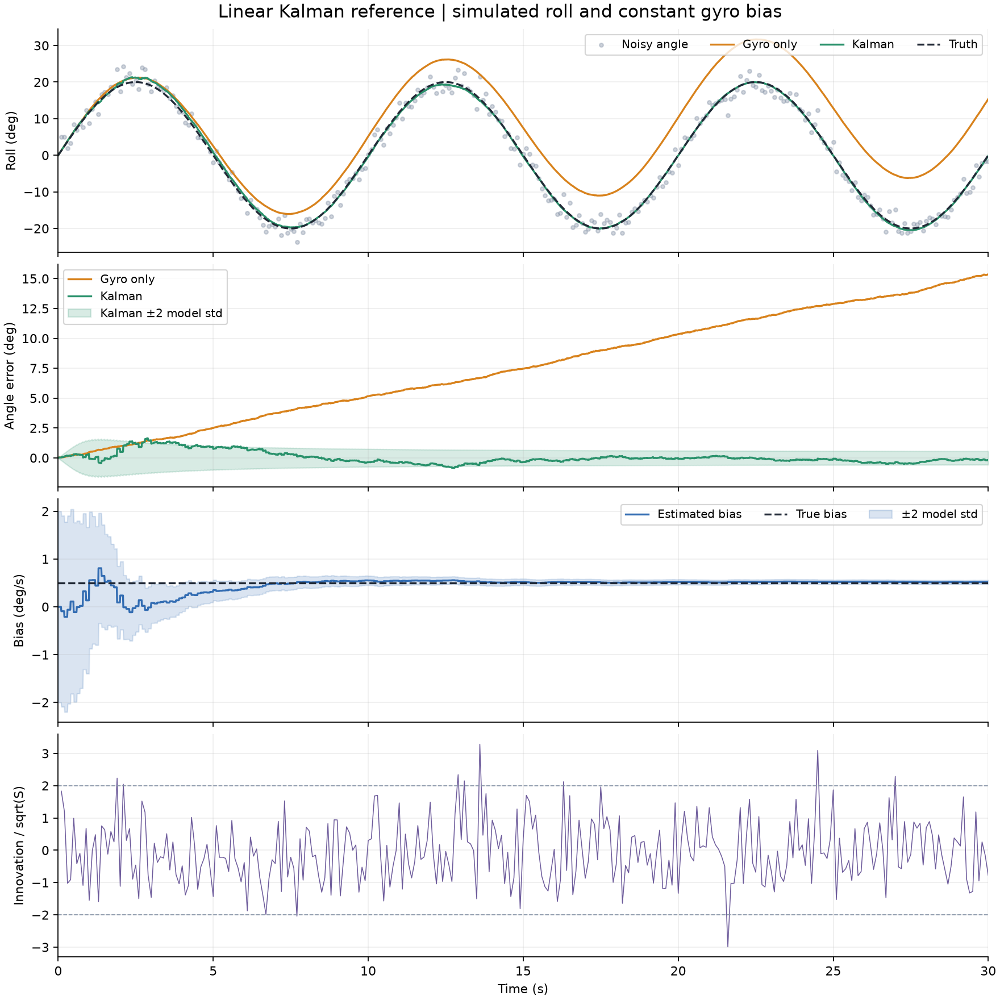

# Linear angle/bias Kalman comparison

A linear Kalman filter combines interval-average gyro measurements with an
independent direct angle observation. The filter estimates roll and constant
gyro bias. Gyro integration provides the baseline on exactly the same measured
gyro stream and with the same known initial angle.



## Configuration

| Parameter | Value |
| --- | --- |
| Motion | Sinusoidal roll, ±20°, 0.1 Hz, 30 s |
| Gyro | 100 Hz interval means; constant bias +0.5°/s; noise std 1°/s per sample |
| Angle observation | Direct unwrapped angle; 10 Hz from t = 0.1 s; noise std 2° |
| Initialization | Known angle 0°; bias estimate 0°/s with initial std 1°/s |
| Filter noise | Matches the simulator; constant bias, no bias random walk |
| Displayed root seed | 42, with separate child-derived gyro and angle seeds |
| Repeated trials | Fixed root seeds 0–19, all other parameters unchanged |
| Environment | Python 3.12.3, NumPy 2.5.3, Matplotlib 3.11.2, Linux |

The [model specification](../../docs/linear-kalman.md) derives Q/R, explains the
predict-then-correct timing, and records the evaluation criteria chosen before
running this experiment. All parameters are illustrative. A direct synthetic angle
observation does not model an accelerometer or prove physical sensor performance.

## Measured results

For the displayed seed 42:

| Method | Angle RMSE over all 3,001 endpoints (°) | RMSE at 300 observation epochs (°) | Final signed angle error (°) |
| --- | ---: | ---: | ---: |
| Gyro integration | 8.853980 | 8.875583 | 15.357701 |
| Linear Kalman | 0.486844 | 0.480127 | -0.203217 |
| Raw angle observation | Not evaluated between observations | 1.934062 | Not an integrated estimate |

Errors use `estimate - truth`; all-endpoint RMSE includes the known initialization.
The observation-epoch column allows a comparison on the same timestamps without
inventing intermediate raw-angle estimates.

The final estimated bias is **0.518524°/s**, giving **+0.018524°/s** error relative
to the true +0.5°/s. Bias RMSE over all endpoints is 0.161948°/s, including the
initial error and transient. Bias converges through repeated angle corrections;
the filter never receives the true bias.

| Metric across seeds 0–19 | Mean | Worst |
| --- | ---: | ---: |
| Kalman all-endpoint angle RMSE (°) | 0.387782 | 0.594161 |
| Absolute final bias error (°/s) | 0.014363 | 0.061124 |

Seed 42 and all 20 repeated trials pass the predeclared criteria: angle RMSE
strictly below 0.75° and absolute final bias error strictly below 0.15°/s for each
trial. No tuning change was made after evaluating these seeds. Full precision
metrics, per-seed results, configuration, initialization, and generator seeds are
in [summary.json](summary.json).

The covariance bands show ±2 standard deviations under the filter's model. The
fourth panel plots each pre-correction innovation divided by its predicted standard
deviation. The mean squared normalized innovation is 0.942302 for seed 42. These
are diagnostics of the assumed model, not a formal consistency test or calibrated
real-world confidence claim. The true bias is held fixed across trials, rather
than sampled from the initial bias prior.

## Reproduce

Install the pinned Python 3.12 environment from the [README](../../README.md).
From the repository root, with a new output directory:

```sh
python -m meridian.kalman_experiment --output outputs/linear-kalman
python -m pytest -q
```

The default command evaluates the displayed seed plus seeds 0–19 and exits with
status 1 if any default-configuration acceptance check fails, retaining the results
for inspection. A different seed or repeat count changes the evaluated seed set;
changed simulation settings disable those default-configuration acceptance claims.

| Export | Contents and units |
| --- | --- |
| `gyro_measurements.csv` | Interval start/end (s), measured rate (rad/s). |
| `angle_measurements.csv` | Observation endpoint (s), measured angle (rad). |
| `truth.csv` | Endpoint (s), true roll (rad), true constant bias (rad/s). |
| `estimates.csv` | Endpoint (s), gyro/Kalman roll (rad), Kalman bias (rad/s), and three distinct covariance entries. |
| `innovations.csv` | Correction endpoint (s), prior innovation (rad), and predicted innovation variance (rad²). |
| `summary.json` | Configuration, metrics, repeated trials, criteria, and environment. |
| `overview.png` | The four-panel figure above. |

State and covariance are stored after any correction at that endpoint, otherwise
after prediction. Covariance units are rad² for angle, rad²/s for the angle–bias
entry, and rad²/s² for bias. Truth remains separate from sensor exports.

The selected figure and summary are copied unchanged from the executed default
run; complete CSVs remain under ignored local outputs. Two complete runs, through
the module and the installed command, produced byte-identical CSV, JSON, and PNG
files in the listed environment. Tests cover independent
hand calculations, agreement with a separate batch solution for constant bias,
sparse-observation time ordering, covariance symmetry/positive semidefiniteness,
noise-stream isolation, and reproducible exports. Versions are pinned; a seed
alone does not guarantee identical random streams or figures across environments.

## Limits and next experiment

This is a favorable model: exact initial angle, constant bias, independent Gaussian
noise with known dispersion, exact interval averages, and synchronous endpoint
observations. Twenty seeds test noise realizations for this fixed configuration,
not robustness to different sensors, models, timing, or motion.

The synthetic angle observation supplies additional information unavailable to
gyro integration alone. Next, model accelerometer specific force and derive the
tilt observation, with sign, wrapping, and acceleration-disturbance checks; add
the complementary baseline on the same data. Real bench acquisition and replay
remain required. Embedded, real-time, and flight validation are not claimed.
