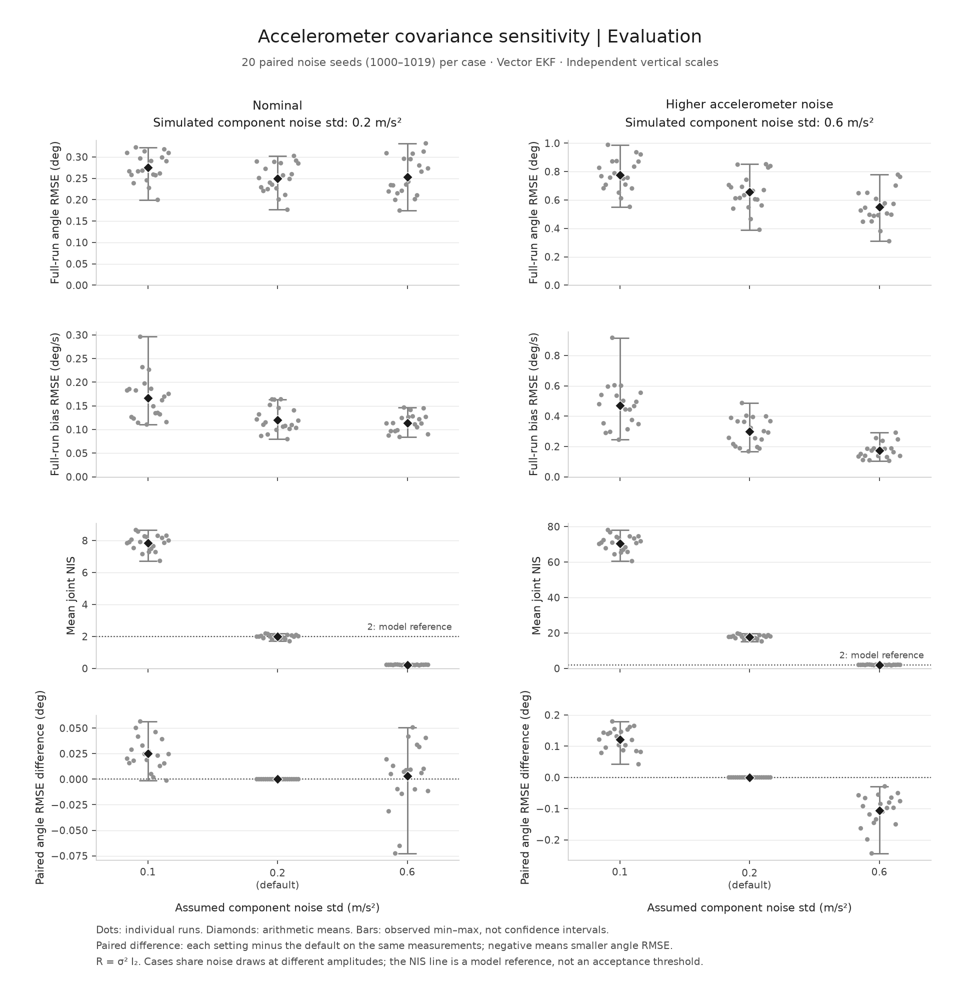

# Accelerometer covariance sensitivity

Changing the EKF's assumed accelerometer noise changes both errors and innovation
diagnostics. In this fixed two-case study, the matched 0.6 m/s² assumption reduces
angle RMSE relative to the default 0.2 on all 20 final-evaluation seeds when the
generated noise is 0.6. Under nominal 0.2 noise, increasing the assumption to 0.6
improves seven seeds and worsens thirteen. The project default remains unchanged.

The [protocol](../../docs/r-sensitivity.md) was written before execution on
2026-09-15. The three settings, two cases, metrics, windows and seed split stayed
unchanged after exploration. This is a local fixed-protocol experiment, not an
externally registered study. No setting was selected or discarded using final
results. All scores are retained in the [exploration JSON](exploration-summary.json)
and [evaluation JSON](evaluation-summary.json).



Dots are individual seeds, diamonds arithmetic means, and bars observed min–max
ranges. They are not confidence intervals. Horizontal positions are three
categories, not a continuous sweep. Vertical scales differ by panel. The NIS
reference line is not an acceptance threshold.

## Final evaluation: seeds 1000–1019

Assumed noise below means the standard deviation of each force component;
`R = sigma_assumed² I₂` in (m/s²)². Only R changes within a case. Angle and bias
RMSE include all 3,001 endpoints over 30 s, including initialization. NIS uses all
300 joint two-dimensional innovations. Values below are arithmetic means of
per-run metrics; brackets show the observed range of the per-run angle RMSE.

| Generated std (m/s²) | Assumed std (m/s²) | Angle RMSE mean [min, max] (°) | Bias RMSE mean (°/s) | Mean joint NIS |
| --- | --- | --- | --- | --- |
| 0.2 | 0.1 | 0.2747 [0.1996, 0.3223] | 0.1667 | 7.8559 |
| 0.2 | 0.2 | 0.2496 [0.1765, 0.3023] | 0.1203 | 1.9814 |
| 0.2 | 0.6 | 0.2527 [0.1746, 0.3317] | 0.1139 | 0.2222 |
| 0.6 | 0.1 | 0.7768 [0.5516, 0.9884] | 0.4695 | 70.5309 |
| 0.6 | 0.2 | 0.6551 [0.3902, 0.8517] | 0.2995 | 17.7546 |
| 0.6 | 0.6 | 0.5493 [0.3096, 0.7781] | 0.1722 | 1.9808 |

The fixed late window covers **25 <= t <= 30 s**, including 501 endpoints. Filters
continue from t=0; they are not restarted for this window.

| Generated std (m/s²) | Assumed std (m/s²) | Late angle RMSE mean (°) | Late bias RMSE mean (°/s) |
| --- | --- | --- | --- |
| 0.2 | 0.1 | 0.2170 | 0.0222 |
| 0.2 | 0.2 | 0.1820 | 0.0217 |
| 0.2 | 0.6 | 0.1738 | 0.0214 |
| 0.6 | 0.1 | 0.5979 | 0.0316 |
| 0.6 | 0.2 | 0.4494 | 0.0283 |
| 0.6 | 0.6 | 0.3458 | 0.0266 |

## Paired comparison against the default

Each difference is computed as the setting's angle RMSE minus the default's
angle RMSE **on the same case and seed**, then summarized over seeds. Negative
means smaller observed angle error. The default's difference is identically zero
on all runs. Signed final errors, every other metric's paired differences and
negative/zero/positive counts for all five RMSE metrics are retained in the JSON.

| Generated std (m/s²) | Assumed std (m/s²) | Mean angle RMSE difference [min, max] (°) | Negative / zero / positive |
| --- | --- | --- | --- |
| 0.2 | 0.1 | +0.0251 [-0.0013, +0.0565] | 1 / 0 / 19 |
| 0.2 | 0.6 | +0.0031 [-0.0726, +0.0507] | 7 / 0 / 13 |
| 0.6 | 0.1 | +0.1217 [+0.0421, +0.1793] | 0 / 0 / 20 |
| 0.6 | 0.6 | -0.1058 [-0.2436, -0.0286] | 20 / 0 / 0 |

The fixed angle baselines use the same measurements and zero initial roll.
Complementary tau remains 1 s. These methods have no estimated bias, covariance
or NIS in this study.

| Generated std (m/s²) | Gyro angle RMSE mean (°) | Complementary angle RMSE mean (°) |
| --- | --- | --- |
| 0.2 | 8.7585 | 0.5665 |
| 0.6 | 8.7585 | 0.9260 |

## Exploration retained separately

Seeds 0–19 were already used in the controlled suite. They provided the exploratory
comparison; seeds 1000–1019 were reserved before developing and checking this
experiment. Implementation tests used seed 42 and exploratory seed 0, not the final
seeds. Both phases kept all three settings. The [exploration figure](exploration.png)
and full JSON retain every outcome. The table makes their angle RMSE means directly
comparable without pooling the phases.

| Generated std (m/s²) | Assumed std (m/s²) | Exploration mean (°) | Final-evaluation mean (°) |
| --- | --- | --- | --- |
| 0.2 | 0.1 | 0.2646 | 0.2747 |
| 0.2 | 0.2 | 0.2448 | 0.2496 |
| 0.2 | 0.6 | 0.2510 | 0.2527 |
| 0.6 | 0.1 | 0.7485 | 0.7768 |
| 0.6 | 0.2 | 0.6392 | 0.6551 |
| 0.6 | 0.6 | 0.5340 | 0.5493 |

At nominal noise, assuming 0.6 instead of 0.2 improves ten exploratory seeds and
worsens ten; the final split is seven/thirteen. Under higher noise it improves
all twenty in each phase. The phases are separate evaluations of the same motion
and noise family, not evidence about a new trajectory distribution. Once inspected,
1000–1019 are consumed evaluation seeds and cannot serve as an untouched set for
future retuning.

## Interpretation and limits

- Under nominal noise, 0.2 has the smallest mean full-run angle RMSE among these
  three settings in both phases. In the final phase, 0.6 has slightly smaller
  mean bias RMSE and late-window angle RMSE. The preferred setting therefore
  depends on the metric and window; this study declares no universal winner.
- Under generated noise 0.6, assuming 0.6 lowers mean full-run angle and bias RMSE
  compared with 0.2 in both phases. This characterizes a known synthetic noise
  mismatch. It is not a noise estimate for a flight controller.
- Matched assumptions have mean joint NIS near two here. Understating R raises
  NIS; overstating it lowers NIS. A smaller NIS is not a better-estimator score,
  and these means do not establish calibrated uncertainty or consistency.
- The gyro inputs and standardized force-noise draws are paired across the two
  cases. They must not be treated as independent trials or combined into one
  population. Observed ranges are descriptive, without confidence bounds or
  significance tests.
- Known initial angle, fixed initial bias error, constant-bias dynamics, independent
  interval-mean gyro noise and pure roll remain controlled assumptions. Changing R
  does not test translations, timing errors, new motion, or an evolving bias.
  New documented bench acquisition and reference-based evaluation remain pending;
  no embedded, real-time or flight accuracy follows.

## Reproduce and inspect

Use the repository's pinned Python environment:

```sh
python -m meridian.r_sensitivity --phase exploration --output outputs/r-exploration
# Inspect exploration with the fixed protocol; keep the full grid unchanged.
python -m meridian.r_sensitivity --phase evaluation --output outputs/r-evaluation
```

Directories must be new. Each command exports a summary and figure plus ten CSVs
per case for the phase's preselected representative seed (0 or 1000): separate
gyro/accelerometer measurements, truth, baseline estimates, and state/covariance
and innovation/NIS files for each R. CSVs preserve full binary64 precision with
17 significant digits. The public selection keeps both summaries and figures;
reproduction regenerates the representative raw arrays locally. The first seed
is an inspection example, not the basis of the aggregate scores.

The summaries record every root and stream seed, named-array measurement
fingerprints, the full protocol and its SHA-256, eight source-module hashes,
and environment versions. Fingerprints identify the same input arrays across
settings; they do not prove hardware origin. Source hashes can be checked after
reproduction against the `source_sha256` field, without needing private files.

Verified locally with Python 3.12.3, NumPy 2.5.3 and Matplotlib 3.11.2. The 30 new
tests independently check shared inputs, separation of truth from filter inputs,
the first correction and fixed Q/P0, full joint NIS, metrics, paired aggregates,
invalid numerical evidence, refusal to overwrite and byte-identical exports.
The complete Python suite passes **709 tests with no skips**, with the existing
C++ integration tests enabled. Default-R results and baselines exactly reproduce
the previous controlled runner on seed 42 in both cases. The C++ algorithm and
web artifact are unchanged; this is a Python experiment, not an additional port
or browser-interaction validation.

Both phases were also reproduced from a separate snapshot containing only public
project files, using the same pinned environment. All **44 exported files** were
byte-identical to the originals, including both JSON summaries, figures and the
representative CSVs. No private project files or recorded drone logs were required.
